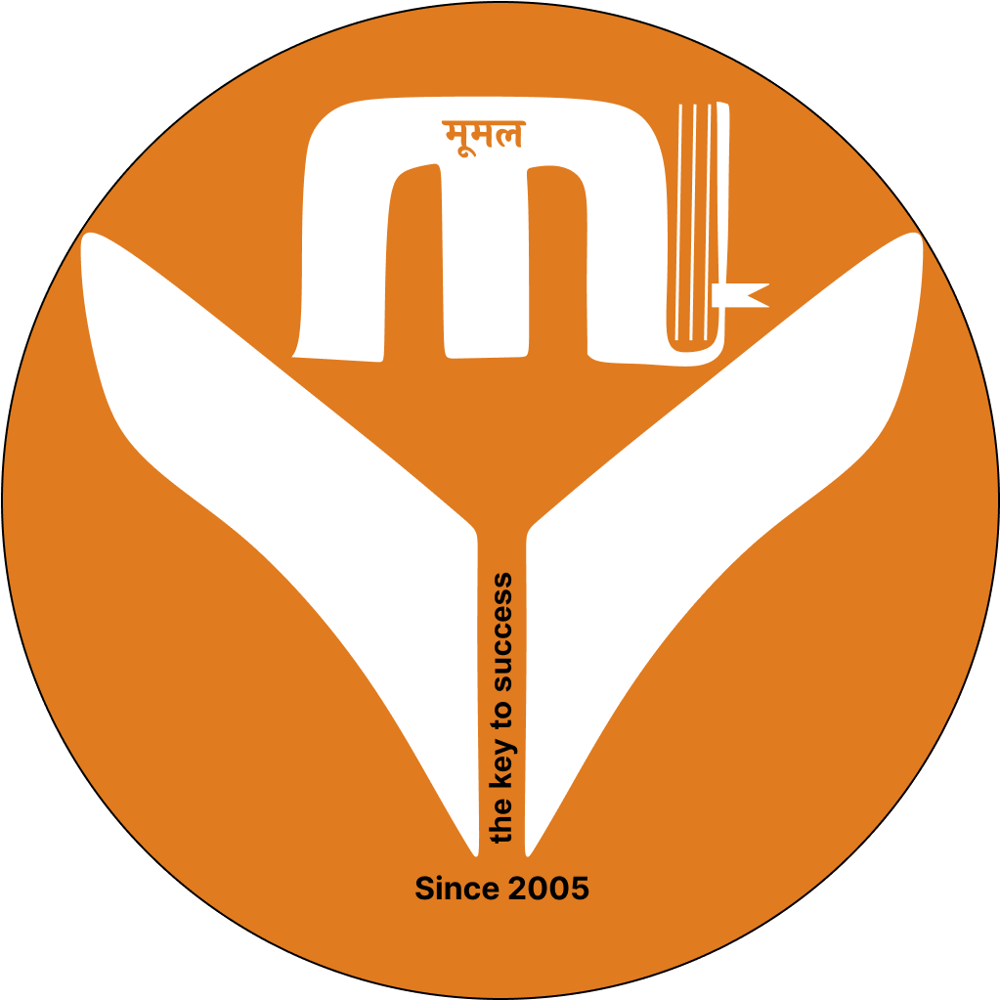

# Moomal Publication

#### Flutter Details :-

- Flutter Version : 3.16.2
- Dart Version : 3.2.2
- Dev Tools : 2.28.3

#### Installation and Run project :-

`flutter clean`

`flutter pub get`

`flutter pub upgrade`

`flutter pub upgrade --major-versions`

`pod install --repo-update`

#### Dependencies Details :-

- get: ^4.6.6
- dio: ^5.4.0
- connectivity_plus: ^5.0.2
- shared_preferences: ^2.2.2
- intl: ^0.19.0
- shimmer: ^3.0.0
- lottie: ^2.7.0
- cached_network_image: ^3.3.1
- flutter_svg: ^2.0.9
- cupertino_icons: ^1.0.6
- internet_connection_checker: ^1.0.0
- dropdown_button2: ^2.3.9
- flutter_rating_bar: ^4.0.1
- url_launcher: ^6.2.2
- flutter_html: ^2.2.1
- payu_checkoutpro_flutter: ^1.0.4
- crypto: ^3.0.3
- share_plus: ^7.2.1

#### Short Description :-

Introducing Moomal App – your ultimate companion for unparalleled exam preparation tailored specifically for competitive exam aspirants. Our app is meticulously designed to elevate your daily study routine with curated Daily Current Affairs Test Papers and a vast repository of Previous Exam Papers. The modules are crafted with excellence, focusing on effective learning strategies, motivational content, and insightful guidance.

Embrace a journey of success as Moomal App empowers you with exceptional study materials at the most affordable rates. Our commitment lies in providing you with top-notch modules, ensuring that every penny spent contributes to maximizing your preparation. Join us on this transformative learning experience, where quality meets affordability, and preparation becomes your daily triumph. Moomal App – where your main day is every day in the pursuit of excellence!

#### Long Description :-

Moomal App is dedicated to preparing you for all competitive exams in Rajasthan, including RAS, SI, Teacher Recruitment (Primary, Secondary, and Tertiary), College Lecturer, Police Recruitment, Patwari, LDC, Agriculture Supervisor, Anganwadi Supervisor, and CET. In the near future, we'll introduce live classes on the Moomal App. Additionally, we'll continue to present well-researched current affairs as part of your daily study routine.
When our team contacts a selected candidate and gathers information about their preparation, it is a matter of pride for us that Moomal Current G. K. has been a significant part of their preparation."
Empowering Success through Knowledge – Moomal Publications is dedicated to providing high-quality educational resources, fostering a culture of learning, and being a catalyst for academic excellence."

Stay tuned as Moomal App enhances your study experience with live classes, daily current affairs discussions, and a comprehensive test series. Our Papers are meticulously crafted to align with the latest curriculum and exam patterns, providing you with increased accuracy and higher success probabilities.
Elevate your preparation to new heights with Moomal App – your go-to platform for success!
Moomal Current G's magazine has been in demand not only in Rajasthan but also from various parts of the country, including small towns and cities. In 2020, we introduced the e-book facility on our website to fulfill this demand. Building on this initiative and leveraging our 15-20 years of experience, we envisioned the Moomal App to continuously benefit our readers. We hope that through this app, your preparation needs will be met comprehensively.

Currently available on the Android platform, the Moomal App will soon be accessible on iOS as well.
We look forward to accompanying you in your early stages of preparation and beyond.
